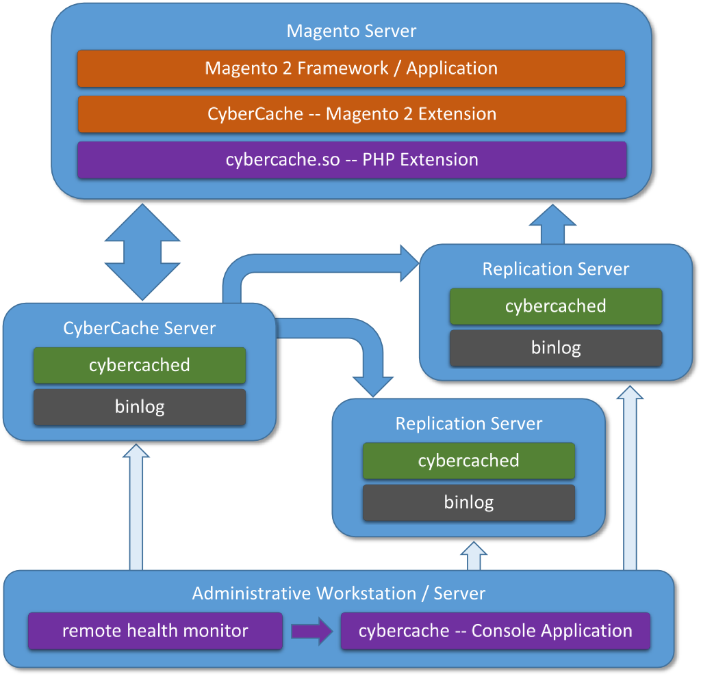
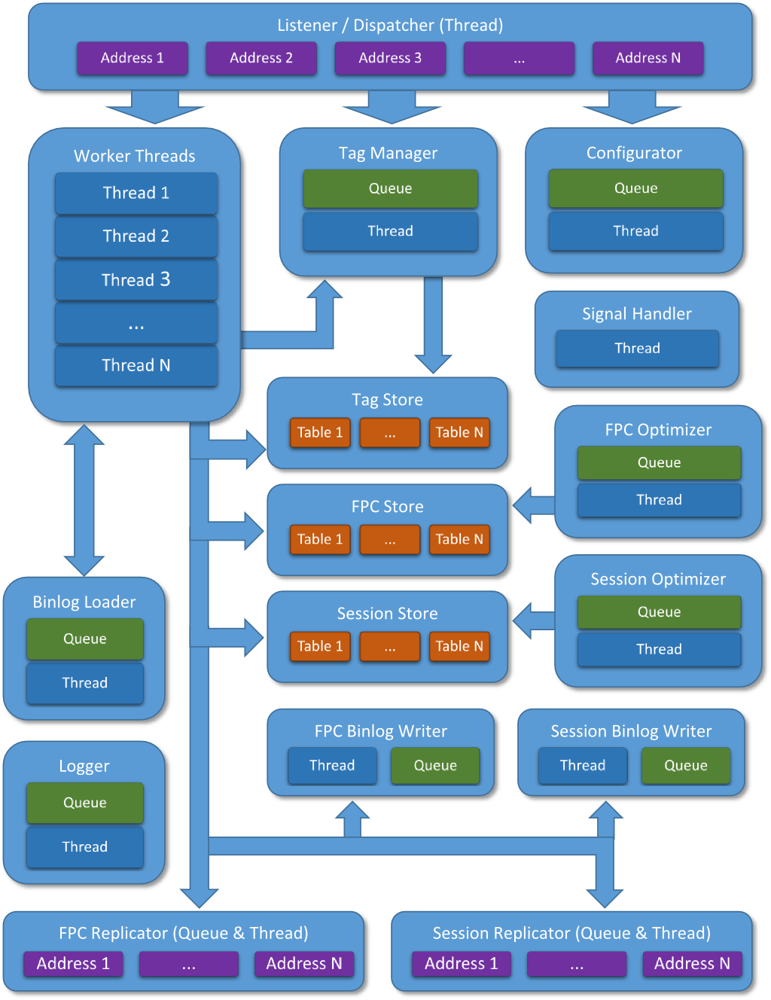

CyberCache Cluster
==================

--------------------------------------------------------------------------------

CyberCache Cluster is a storage/cache solution specifically designed for Magento
2 e-commerce platform. In a nutshell, it provides functionality similar to that
of [Redis store](https://redis.io/), in that it can be used as Magento

- Session store (this is where user data such as carts etc. reside),
- Default cache or a [custom
  cache](http://devdocs.magento.com/guides/v2.1/config-guide/cache/caching_frontend-cache-types.html),
  and
- Full page cache (this is where pre-rendered [parts of] web pages are stored).

It is, however, more efficient and sometimes more reliable (e.g. when used as a
session store -- because of *internal* support for session locks).

Performance Advantages
----------------------

Compared to existing solutions (of which Redis arguably represents the very
best session store and cache back-end implementation), CyberCache Cluster
provides significant performance benefits because of the following features:

- It is a **multi-threaded**, highly concurrent application capable of utilizing
  all available CPU cores,

- It can hold **more records** in the same amout of RAM because

   - its optimizer re-compresses data in the background using advanced
     algorithms (from the *built-in* set of **eight** algorithms) that can be
     specially "trained" for particular session/FPC data,

   - it "understands" Magento data (e.g. record tags get special treatment;
     session records are slighly more compact than FPC because CyberCache
     "knows" they cannot be tagged, and so on),

- Its network protocol and API are **designed to closely match** Zend cache and
  PHP session interfaces; the network protocol is binary, having minimal overhead,

- Its Magento 1 and 2 extensions utilizes **native-code `cybercache` PHP
  extension** (written in C/C++; read: fast), which directly maps PHP session
  and Zend cache APIs to server calls (through server's network API) with
  minimal overhead,

- It is better at keeping **relevant records**:

  - CyberCache's cache eviction algorithm is a *true* LRU ([Least Recently
    Used](https://en.wikipedia.org/wiki/Cache_replacement_policies#LRU)) one,
    not based on statistical sampling (as is the case with Redis), and yet has
    O(1) complexity (read: is very fast),

  - the cache is fully user-agent-aware, capable of not only assigning different
    life times to records created by, say, bots and regular users (which Redis
    also does nicely), but also limiting the number of records (e.g. sessions)
    that can be created by particular types of users.

- It manages memory used by session and FPC stores separately; this is important 
  enough for recommended Redis configuration to be two separate Redis instances
  managing session and FPC stores; with CyberCache, single server instance can
  be configured to not only have separate memory limits, but even different 
  cache eviction strategies, compression methods, optimization settings, etc. 
  for its session and FPC stores.

Other Important Features
------------------------

In addition to preformance advantages, CyberCache also provides other benefits:

- **Replication**: CyberCache can be configured to forward data-changing
  commands it receives to arbitrary number of "slave" CyberCache servers (hence
  "Cluster" in its name),

  > Like all other auxiliary tasks (binlog [see below] output and even input,
  > regular logging, configuration changes, record optimization, etc.),
  > replication is performed concurrently with servicing cache storage/retrieval
  > requests -- that is, with minimal overhead.

- **Binlog**: CyberCache can write binlog of all data-changing commands, which
  can then be used to restore server state in case of any problem,

- **Configurability**: with *more than 100 options*, CyberCache provides ample 
  opportunities to tailor it for any particular setup.

  > Almost all options (all but half a dozen) can be changed at run time,
  > through `cybercache` console application or from PHP code, without
  > re-starting or even pausing the server.

  Despite having more than one hundred configurable options, CyberCache cluster
  is not a "feature creature": all the options have sensible defaults, so all
  that is needed to get it going is, basically, set RAM sizes its stores are
  allowed to use, and IP address for the extension to connect to.

Applications Comprising The CyberCache Cluster Suite
----------------------------------------------------

The CyberCache Cluster Suite consists of the following:

1. Server application, `cybercached` (plus instrumented build [see below],
   `cybercachepd`, in Enterprise Edition).
2. Console application, `cybercache`.
3. PHP extensions, `cybercache.so` (PHP 7.0, 7,1, 7.2, and 7.3 are supported).
4. Magento 1 and 2 extensions, `CyberCache`.
5. Console test set (console command files testing/verifying cache server operation).
6. PHP extension test set (PHP scripts testing/verifying cache server operation).
7. Default configuration files with extensive comments.
8. Complete documentation set (configuration, usage, protocols).

Architecture Overview
---------------------

The following diagram illustrates basic principles of CyberCache Cluster usage:

Please note that CyberCache server does not have a notion of a "master" of
"slave" (replication) mode: it just listens to a set of addresses on a port, and
can be configured to replicate the data-changing (but, obviously, not data
fetching, or configuring) commands to another set of addresses on the same or
different port. It is entirely possible to program client to write data to one 
instance, but get cached records from a range of others.

> Like almost all other options, both listening/replication addresses and ports 
> can be configured at run time, without re-starting or even pausing the server.

CyberCache Server Architecture
------------------------------

Internal server architecture is illustrated by the below diagram.

> The diagram simplifies many things, of course, and does not show many 
> connections; for instance, Configurator has access to all subsystems, and all 
> subsystems have access to the Logger. Likewise, many connections are not shown
> as bi-directional (even though they are) to emphasize **control** flow.

As can be seen from the diagram, number of threads exceeds (by far) the number
of CPU cores available in most server boxes; that said, idle threads "sleep" on
system objects, and *do not consume* any CPU resources whatsoever.

Concurrent Processing
---------------------

The above architecture diagram shows that number of concurrent threads of
execution is 12 plus the (configurable) number of worker threads handling
incoming connections.

> Just like almost any other option, the number of worker threads can be changed 
> at run time, without restarting or even pausing the server.

CyberCache employs a number of techniques to make inter-thread communication
efficient:

1. Asynchronous I/O is used to handle incoming connections; that's what `nginx`
and other high-perfrormance applications use to be able to process thouthands of
concurrent connections.

2. CyberCache uses queues to pass messages and data between threads, thus 
avoiding resource locking almost completely. This technique is what makes 
`Google Go` language so efficient in massively parallel applications; in `Go`, 
queses are known as "channels".

  > It is the use of queues for inter-thread communication that makes it possible
  > to configure almost any option at run time without any interruptions.

3. Whenever possible, so-called "lock-free programming" is used (see [this Wiki
page](https://en.wikipedia.org/wiki/Non-blocking_algorithm) for reasons of why
it is important), utilizing atomic data primitives available in C++ 11.

4. CyberCache stores data in massively distributed structures: not only are
there separate stores for session records, FPC data, and tags, but each store
can be configured to use up to 256 (in Enterprise Edition) hash tables, thus
reducing to the minimum chances of a hash table being locked for writing when
another thread is trying to access it while servicing a different request.

5. A worker thread can only lock a table when it adds a brand new record with an
ID that did not exist yet. When a record is being deleted, the table is never
locked: the record is only marked as "deleted" (although record's data buffer
can be removed immediately -- if the record is not being replicated, or stored
to binlog -- as that does not require a table lock). If a table has records
marked as "deleted", then a thread adding a new record will "see" it, and
perform quick bulk removal.

6. Individual cache records are first locked with synchronization primitives
known as spin locks: lighweight mechanisms that do not cause thread context
switch, and only take few CPU cycles to execute, thanks to C++ 11 atomics.

7. Many other techniques are used, too numerous to be listed here... As an
example: when optimizer checks records, it only *tries* to lock them using a
spin lock; if a record is not being used, the optimizer actually locks it, and
checks if it is already marked as "optimized"; if it's not, it *unpacks* it,
sets `being-optimized` flag, and unlocks. Then it starts compressing it with all
enabled (in its configuration) algorithms, one after another, trying to find one
that produces the smallest compressed version of the record. Again: during all
this activity, the record is not locked; it can be read or even written (in
latter case, the `being-optimized` would be cleared). When optimizer finishes
record optimization, it locks it again and checks `being-optimized` flag: if it
is still set, it replaces record's data buffer (lightning-fast); otherwise, it
just discards optimization result, and tries again.

Health Checks and Monitoring
----------------------------

CyberCache server's configuration thread runs periodic health checks (frequency 
is, of course, configurable). During these checks, it monitors great many 
things; e.g. available disk space for binlogs and regular log, the time spent by 
each thread processing last command (thus detecting hung threads), and so on.

If a problem is detected during health check, its description is logged. If 
there is a problem with CyberCache's own concurrent log, it falls back to system 
log facility.

Like many other servers, CyberCache can be `ping`-ed: it is possible to send a
special `PING` command using either `cybercache` console application (which has
interactive and non-interactive modes), or `c3_ping()` function available in
`cybercache.so` PHP extension. If everything is OK with the server, it would
return `OK` response (and PHP method would return `true`); otherwise, the server
would send `ERROR` response, and PHP method would return `false`).

Additionally, CyberCache server has `CHECK` command, mirrored with PHP extension
function `c3_check()`; it returns three integers: CyberCache (*not* server box!)
CPU load in percents, number of errors, and number of warnings since the server 
was started (*not* since last `CHECK` command, so one should only worry if these 
numbers *grow* over time).

The two remaining informational commands are `INFO` and `STATS`; the former runs
health check and returns detailed information on server status, while the latter
returns current values of so-called performance counters.

Finally, there are lots of so-called "administrative" commands that can be used
to *remotely* examine server status in detail, check or change options, force
log and/or binlog rotation, load new local or remote configuration file, restore
server stores from binlogs, shut down the server, etc. -- all without
interrupting operation (with the obvious exception of the `SHUTDOWN` command
that is, well, meant to interrupt). All this can be done using either console
application, of PHP script (using functions available in the `cybercache.so` PHP
extension).

All in all, CyberCache server provides exhaustive means of remote examination
and control. See `command_interface.md` and `protocol.md` documentation modules
for futher information.

CyberCache Cluster Editions
---------------------------

CyberCache is available in two editions, Community and Enterprise, which differ
in a number of ways:

- Maximum number of tables per store is `4` (in Community Edition) vs. `256` (in
Enterprise Edition).

- Number of worker threads is limited by `6` in Community Edition, and `48` in 
Enterprise Edition.

- In addition to the regular (production) build of the CyberCache server,
Enterprise Edition includes so-called instrumented build that allows cache
profiling -- collecting information during run time in so-called performance
counters: values of these counters can later be used for fine-tuning server
configuration.

> The above-mentioned `STATS` server command is only implemented in instrumented
> build, and will return error message if sent to a non-instrumented build of
> the server.

- Maximum number of IP adresses per subsystem (such as a listener, or a
replicator) is currently `2` in Community, and `16` in Enterprise Edition.

- Community Edition is limited to 32 gigabytes of memory per store, whereas
Enterprise Edition's limit is 128 **tera**bytes per store.

- Include files in configurations and command scripts can be nested up to the 
depth of two in Community, and eitght in Enterprise edition.

- Enterprise edition allows to set "minimum number of tags per FPC record", 
which can spare some extraneous memory allocations.

Other Applications
------------------

Even though CyberCache Cluster was specially designed to support Magento, it can
be used with other frameworks, too; specifically:

1. With any PHP framework -- as session store

  CyberCache server essentially implements `SessionHandlerInterface`, which is 
  the standard PHP core interface for session storage.

2. With any PHP framework built around Zend Framework -- as cache back-end

  CyberCache implements all methods found in `Zend_Cache_Backend_Interface` and 
  `Zend_Cache_Backend_ExtendedInterface` interfaces of the Zend framework, thus 
  making possible its use as a cache store back-end.

The amount of PHP coding required for such applications should be absolutely 
minimal -- mere wrapper/thunk methods in framework-specific classes.
